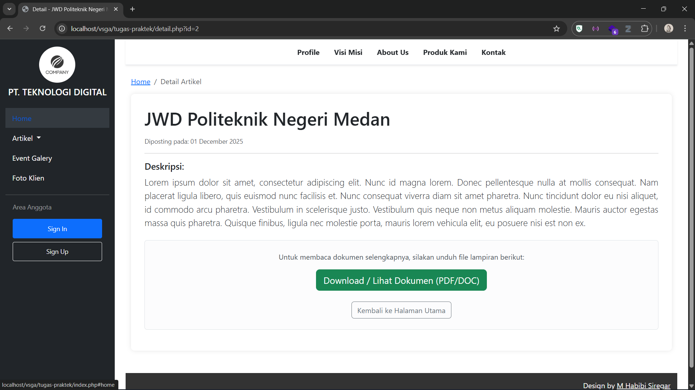

  

<h1 align="center">VSGA – Tugas Praktek</h1>

  <a href="#project-description">Project Description</a> •
  <a href="#key-features">Key Features</a> •
  <a href="#tech-stack">Tech Stack</a>

---

## Project Description

Website ini dibuat untuk memenuhi tugas praktik sertifikasi **Junior Web Developer** dari **LSP Teknologi Digital** dan **Komdigi**.  
Project ini berisi implementasi dasar website company profile dengan fitur artikel dan halaman admin untuk melakukan CRUD data.

---

## Key Features

- **Company Profile** dengan fitur artikel
- **CRUD System** melalui halaman admin
- Struktur kode rapi dan mudah dikembangkan
- Menggunakan teknologi web standar modern

---

## Tech Stack

**Front End** : Bootstrap 5.3.0 (CDN)  
**Back End** : PHP Native 8.2  

---

## Screenshot

  

